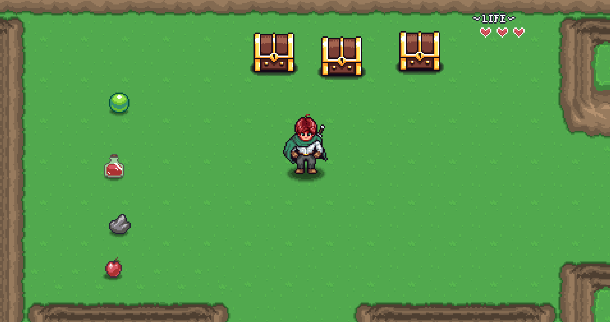
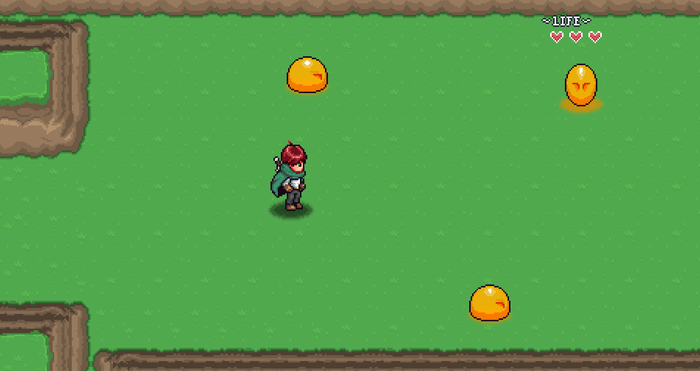

# 2D Action-Adventure RPG in Godot ⚔️

Welcome! This repository features a **2D Action-Adventure RPG** built with the Godot Engine. The codebase was developed following the core mechanics from the **Michael Games** YouTube tutorial series, with custom tweaks and implementations.

The goal of this project is to provide a clean, solid foundation for understanding key Action RPG mechanics using **GDScript**.

---

## 🛠️ Technical Requirements

*   **Engine Version:** Built and tested using **Godot 4.7.1**
*   **Language:** GDScript

---

## 📸 Screenshots

Here is a preview of the project in action:

*Figure 1: Character movement and environmental exploration.*

*Figure 2: Enemies and health bars*

---

## 🚀 Key Features

*   **Finite State Machine:** A clean and robust state machine implemented in GDScript to manage player states (Idle, Walk, Attack).
*   **Advanced Animations:** 
    *   Full 4-directional walking animations.
    *   Dynamic clothing/outfit movement physics while the character is in the *idle* position.
*   **Combat Mechanics:** Fluid attack animations coupled with accurate hit detection to damage enemies.
*   **Enemies & UI:** Fully functional enemies with basic AI and overhead **health bars** to track damage.
*   **Inventory & Item System:** Item pickup system with usable mechanics, such as drinking health potions to restore HP.

---

## 🎮 Controls

The game supports standard PC gaming controls as well as directional arrow keys:

| Action | Primary Key | Alternative Key |
| :--- | :--- | :--- |
| **Move Up** | `W` | ⬆️ Up Arrow |
| **Move Down** | `S` | ⬇️ Down Arrow |
| **Move Left** | `A` | ⬅️ Left Arrow |
| **Move Right** | `D` | ➡️ Right Arrow |

---

## 🛠️ Credits & Acknowledgments

This project was built using the tutorials from **Michael Games**. You can find his educational content and gamedev guides on his official [YouTube Channel](https://www.youtube.com/@MichaelGamesOfficial).
